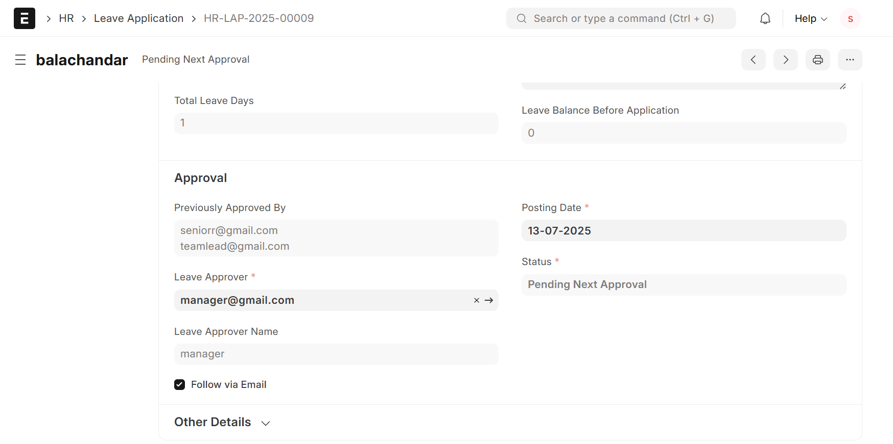

# Ladder Approve: Dynamic Multi-Level Leave and Expense Approval for ERPNext

**Ladder Approve** is a custom Frappe app built to enhance ERPNext's approval workflows by introducing a dynamic, multi-level approval system for **Leave Applications** and **Expense Claims**. It leverages the employee hierarchy defined in the Employee Doctype and ensures approvals are routed and managed efficiently across all levels—culminating in a final decision by HR.

---

## Key Features

### Automated Routing

* Leave and Expense requests are automatically routed to the employee's immediate manager using the `reports_to` field in the Employee master.
* The document flows up the chain of command until it reaches an HR Manager for final approval.

### HR Final Approval

* Final decision authority lies with users who have the **HR Manager** role.
* Supports multiple HR Managers; any one can approve/reject when it's their turn.

### Approval History

* Custom field `custom_previous_approvers` tracks all users who have approved the document previously.
* Useful for auditing and tracking escalation paths.

### Forwarding Capability

* Mid-level approvers can **forward** documents to their next reporting manager.
* If no higher approver is found, the document is automatically routed to an HR Manager.

### Action Control & Smart Permissions

* **Only the current approver** has access to approve/reject.
* Read-only views for others.
* Dynamic permission query restricts access to:

  * Document Owner (Applicant)
  * Current Approver
  * Previous Approvers
  * Users with roles: System Manager, HR Manager, Administrator

### Email Notifications

* Sent automatically during each transition:

  * On forwarding to next approver
  * On final approval
  * On rejection (includes reason)

---

## Technical Implementation

### Client-Side (JS)

* Custom Client Scripts control UI elements dynamically:

  * Show/hide **Approve** and **Reject** buttons
  * Enable/disable primary save button based on document state and role
  * Prevent unauthorized users from editing or submitting

### Server-Side (Python)

* API methods to update the current approver and send notifications
* Validation logic in `before_save` and `before_submit` hooks
* Feature toggle validation based on HR Settings and Employee-level override flags

### Customizations

* **Custom Fields**:

  * `custom_previous_approvers` (Small Text): To store previous approver usernames
  * `expense_approver`, `leave_approver`: To track current approver per doc

* **Property Setters**:

  * Makes `status` field editable in draft for workflow control

* **HR Settings**:

  * Two checkboxes to enable/disable multi-level logic per feature:
    * Multi-Level Leave Approval
    * Multi-Level Expense Claim Approval

  * These options can be overridden on an individual Employee level

### Notifications

* Defined via **Notification** Doctypes:

  * Use Jinja templating for dynamic emails
  * Triggered based on document events (Submit, Update, Rejection)

### Fixtures

* App includes fixtures for:

  * Custom Fields
  * Property Setters
  * Notifications
  * Permission Query Scripts

---

## Installation Guide

```bash
# Step 1: Get the app
bench get-app ladder_approve https://github.com/Beveren-Software-Inc/ladder_approve.git

# Step 2: Install the app on your site
bench --site yoursite install-app ladder_approve
```

---

## Configuration Steps

### 1. Enable Global Flags in HR Settings

Enable these checkboxes in **HR Settings**:

* Enable Multi Level Leave Approval
* Enable Multi Level Expense Claim Approval

### 2. Disable Approval for Certain Employees

In the Employee master, disable multi-level approval for specific employees:

### 3. Use Custom Buttons

Users see context-specific buttons like Approve and Reject depending on their role:

### 4. Review Approval History

View all past approvers directly from the document:

---

## Example Use Case

1. **Employee A** submits a leave application.
2. It is routed to their direct manager **Employee B**.
3. B reviews and clicks **Approve** – the app updates the document to assign **Employee B's** manager (Employee C).
4. C finally approves or forwards to HR.
5. HR Manager **Employee D** sees it and takes final action.
6. At each stage:

   * Only the current approver sees actionable buttons.
   * Notifications are sent.
   * Audit log grows with previous approvers.

---


1. Enable Multi Level Leave Approval and Multi Level Expense Claim Approval in HR Settings


2. Employee wise disabling the Multi Level Leave Approval and Multi Level Expense Claim Approval


3. Custom Buttons for Approval and Rejection


4. List of Previous Approvers
